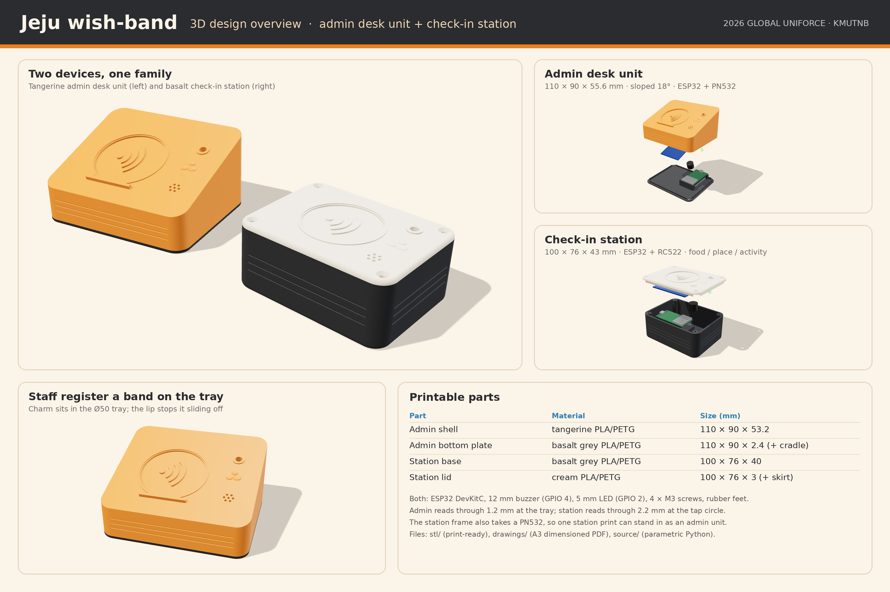

# Jeju wish-band: device enclosures (3D)

Printable 3D enclosures for the two Jeju wish-band devices: the **admin desk unit** used by staff to register bands, and the **check-in station** used at food, place and activity stops. The folder also has renders and dimensioned drawings.



## What is here

| Folder | Contents |
|---|---|
| `stl/` | Print-ready STL files, already placed the right way up for printing. `scene.json` lists every size and volume. |
| `drawings/` | `jeju-wish-band-device-drawings.pdf` has two A3 sheets at 1:1: sheet 1 is the admin desk unit and sheet 2 is the check-in station. Print at 100 % and the sizes are true. PNG copies of each sheet are included. |
| `renders/` | The overview poster (PNG + PDF), both devices together, and each device whole and exploded. |
| `source/` | Parametric source. `models.py` builds the STLs and `drawing.py` makes the drawings. `render.html`, `render_shots.mjs` and `compose_overview.py` make the renders. |

## Devices

| Device | Firmware | Parts to print | Outside size (mm) |
|---|---|---|---|
| Admin desk unit | `firmware/admin` (ESP32 + PN532 over I2C) | `admin_shell.stl` (tangerine), `admin_bottom_plate.stl` (basalt grey) | 110 × 90 × 55.6, top sloped 18° |
| Check-in station | `firmware/food`, `place`, `activity` (ESP32 + RC522) | `station_base.stl` (basalt grey), `station_lid.stl` (cream) | 100 × 76 × 43 |

Both devices also need an ESP32 DevKitC, a 12 mm buzzer on GPIO 4, a 5 mm LED on GPIO 2, four M3 self-tapping screws and four Ø10 rubber feet.

**Admin desk unit.** Staff place the wristband charm in the Ø50 tray on the sloped top, and a small lip stops it sliding off. The PN532 is held in a frame under the tray and reads through 1.2 mm of plastic. The ESP32 sits in a cradle on the bottom plate with its USB port at the back wall. The shell is printed lying on its sloped top, so it needs no supports.

**Check-in station.** Tourists tap the charm on the Ø46 circle on the lid. The RC522 is held in a frame under the lid and reads through 2.2 mm of plastic. The ESP32 sits in a floor cradle with its USB port at the left wall.

**Can one enclosure do both jobs?** Yes. The reader frame in the station lid also takes a PN532, so a printed station can serve as the admin unit with no changes. The admin unit is a separate design because a sloped desk tray is easier for staff to use.

## Assembly

1. Push the buzzer and LED into their tubes under the top.
2. Stick the reader board into its frame with foam tape.
3. Clip the ESP32 into its cradle with the USB port facing the opening.
4. Close the enclosure with four M3 screws and add the rubber feet.

## Assumed sizes (check yours before printing)

- ESP32 DevKitC V4: 54.4 × 27.9 mm, header pins pointing down
- RC522: 60 × 40 mm
- PN532 V3: 42.7 × 40.4 mm
- Buzzer: Ø12 × 9.5 mm
- LED: 5 mm

## Changing the design

Every size is in `PARAMS` at the top of `source/models.py`. Change a number, then rebuild:

```bash
pip install manifold3d trimesh numpy matplotlib shapely networkx
cd source
python3 models.py     # writes ../stl/*.stl
python3 drawing.py    # writes ../drawings/
```

To rebuild the renders:

1. In `source/`, run `npm i three playwright && npx playwright install chromium`.
2. Copy `../stl/scene.json` into `_render_parts/`.
3. Run `node render_shots.mjs family admin admin_exploded station station_exploded`.
4. Run `python3 compose_overview.py`.
