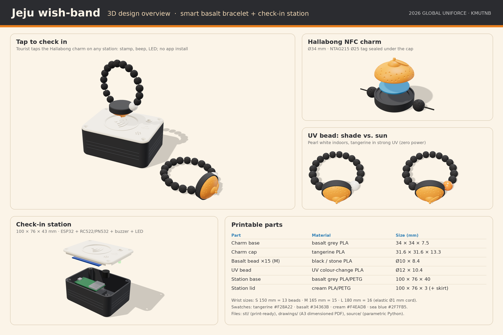

# Jeju wish-band: 3D design

Printable 3D models for the Jeju wish-band bracelet and the check-in station, with renders and dimensioned drawings.



## What is here

| Folder | Contents |
|---|---|
| `stl/` | Print-ready STL files, already in print orientation (flat side on the bed). `scene.json` lists sizes, volumes and bead counts. |
| `drawings/` | `jeju-wish-band-3d-drawings.pdf`: two A3 sheets with dimensions (wristband at 2:1, station at 1:1). Print at 100 % and the scale is true. PNG copies of each sheet are included. |
| `renders/` | Overview poster (PNG + PDF) and separate renders: tap check-in, charm exploded, station exploded, bracelet in shade and in sun. |
| `source/` | Parametric source. `models.py` builds every STL; `drawing.py` makes the drawings; `render.html`, `render_shots.mjs` and `compose_overview.py` make the renders. |

## Parts

| Part | Qty | Material | Size (mm) |
|---|---|---|---|
| `wristband_charm_base.stl` | 1 | basalt grey PLA | 34 × 34 × 7.5 |
| `wristband_charm_cap.stl` (Hallabong) | 1 | tangerine PLA | 31.6 × 31.6 × 13.3 |
| `wristband_basalt_bead.stl` | 13 / 15 / 16 for S / M / L | black or stone PLA | Ø10 × 8.4, hole Ø2 |
| `wristband_uv_bead.stl` | 1 | UV colour-change PLA | Ø12 × 10.4, hole Ø2 |
| `station_base.stl` | 1 per station | basalt grey PLA or PETG | 100 × 76 × 40 |
| `station_lid.stl` | 1 per station | cream PLA or PETG | 100 × 76 × 3 plus skirt |

Bought parts: NTAG215 Ø25 mm NFC sticker, 1 mm clear elastic cord (about 25 cm per band), CA glue. Per station: ESP32 DevKitC, RC522 (or PN532 for the admin desk), 12 mm buzzer, 5 mm LED, four M3 × 8 self-tapping screws, four Ø10 rubber feet.

## Assembly

1. **Charm:** stick the NFC tag in the pocket of the charm base, add a drop of CA glue on the rim, press the cap in.
2. **Bracelet:** thread the elastic cord through the charm channel, the UV bead and the basalt beads, then tie a surgeon's knot and pull it inside the charm channel.
3. **Station:** clip the ESP32 into the floor cradle with its USB port at the side opening. Fix the RC522 in the frame under the lid with foam tape, with the antenna end under the tap circle. Push the buzzer and LED into their tubes under the lid, then screw the lid on.

## Assumed sizes (check yours before printing)

ESP32 DevKitC V4 54.4 × 27.9 mm with pins pointing down; RC522 60 × 40 mm; PN532 V3 42.7 × 40.4 mm; buzzer Ø12 × 9.5 mm; LED 5 mm; NTAG215 sticker Ø25 × 1 mm; adult wrist 150 / 165 / 180 mm.

## Changing the design

Every size is in `PARAMS` at the top of `source/models.py`. Change a number and rebuild:

```bash
pip install manifold3d trimesh numpy matplotlib shapely networkx
cd source
python3 models.py     # writes ../stl/*.stl
python3 drawing.py    # writes ../drawings/
```

If the cap is too tight or too loose on your printer, change `fit_clearance` (default 0.2 mm per side).

Renders: in `source/`, run `npm i three playwright && npx playwright install chromium`, copy `../stl/scene.json` into `_render_parts/`, then run `node render_shots.mjs hero exploded charm bracelet "bracelet?uv=1"` and `python3 compose_overview.py`.
